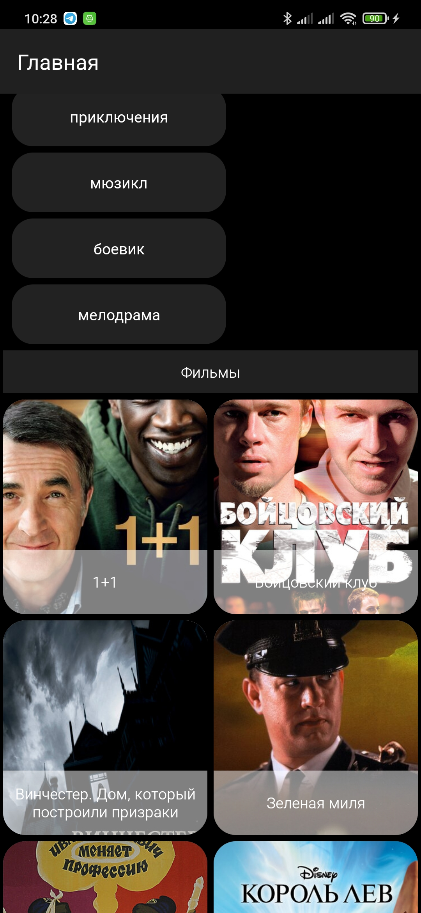
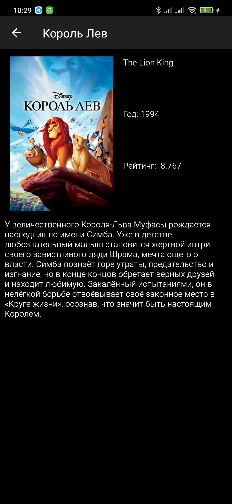

# SequeniaTestTask

[apk для теста](https://github.com/Malovichko/SequeniaTestTask/tree/master/apk)

Отладка и запуск приложения проводились на физическом устройстве Xiaomi mi 9.

- [X] Kotlin
- [X] Среда разработки: Android Studio
- [X] minSdk 21
- [X] Ориентация экрана: вертикальная, горизонтальная
- [X] Использован MVP подход к проектирования архитектуры
- [X] Библиотеки: Retrofit для сетевых запросов без RxJava

## Список фильмов с фильтром
 

## Подробная информация о фильме 

